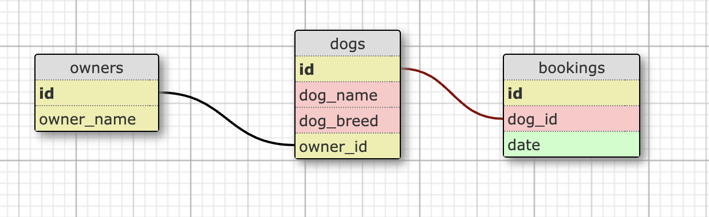

# DoggyDB

DoggyDB is a site made for dogs who are looking to book their next salon treatments at **F**uzzy **A**ffection **C**anine Salon.

## Remote Deployment

This app is deployed on fly.io and can be accessed at: <https://doggydb.fly.dev/>

## Run Locally

Clone the project

```bash
  git clone https://github.com/fac28/DoggyDB.git
```

Go to the project directory

```bash
  cd DoggyDB
```

Install dependencies

```bash
  npm install
```

Start the server

```bash
  npm run start
```

## Usage

View all the current bookings on our home page and click on **'Add a Booking'** to make your booking.

We welcome all new and existing customers. If you are not currently registered with us, we will automatically register you as a customer when you make your first booking.

## Schema

Schema showing the relationships between our tables



## Tech Stack

fly.io, Node, Express
